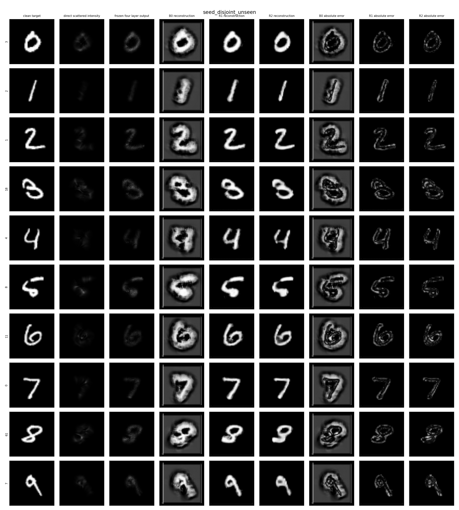
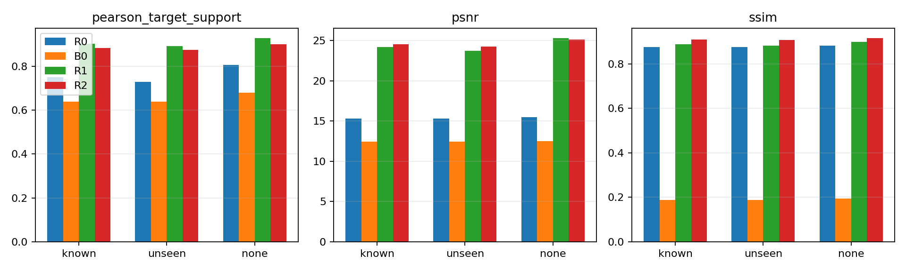

# Scattering GAN Simulation

A compact research simulation for reconstructing clean targets from
scattering-corrupted coherent intensity measurements. The repository contains
a legacy U-Net/PatchGAN path, a sealed paper-aligned four-layer diffractive R0
baseline, a completed fixed-four-layer digital-backend ablation, and an
independent visible-light Huang 2026 numerical profile.

```text
MNIST target -> coherent field -> scattering-like corruption -> propagation
             -> fixed diffractive layer -> U-Net -> optional PatchGAN

MNIST amplitude -> correlated diffuser -> trainable phase layers
                -> detector intensity
```



## Scope

This repository is a simulation baseline for research development, not a
calibrated optical instrument or a generic image-to-image GAN example. It is
intended to support controlled experiments on fixed diffusers, unseen diffuser
generalization, adversarial refinement, and later diffractive front ends.

Each training run writes a schema-v1 `config.json` before training, then
records the diffuser split, optical parameters, observation normalization,
loss weights, metric aggregation protocol, package versions, and Git state in
its manifest. The flat `metrics.json` format is retained for compatibility.

## Quick Start

Python 3.12 and `uv` are required.

```bash
git clone <repository-url>
cd scattering-gan-sim
uv sync --group dev
uv run python -m check_deps
uv run pytest
```

List all experiment commands:

```bash
uv run python -m experiment --help
```

## Experiments

Inspect one coherent optical path:

```bash
uv run python -m experiment d2nn \
  --output-dir outputs/d2nn_inspection \
  --download \
  --corruption phase
```

Run a minimal U-Net smoke test:

```bash
uv run python -m experiment unet \
  --output-dir outputs/unet_small \
  --download \
  --max-train-batches 1 \
  --max-eval-batches 1
```

Run an unseen-diffuser E1 experiment:

```bash
uv run python -m experiment unet \
  --output-dir outputs/e1_unseen \
  --download \
  --train-diffuser-ids 0 1 2 3 \
  --eval-diffuser-ids 4 5 \
  --train-limit 2048 \
  --eval-limit 256
```

The manifest reports `eval_diffuser_split: "unseen"` when evaluation IDs are
disjoint from training IDs. Run a corresponding seen-diffuser experiment with
evaluation IDs drawn from the training set.

The same reconstruction-loss flags are available to `unet`, `gan`, and
`full`: `--l1-weight`, `--negative-pearson-weight`, `--ssim-weight`, and
`--fourier-weight`. Their exact values are saved in both `config.json` and the
manifest.

Assess the frozen Luo 2022 R0 profile before a full run:

```bash
uv run python -m experiment d2nn \
  --profile luo2022_r0 \
  --action assess \
  --device cpu \
  --output-dir outputs/luo2022_r0_assessment
```

Freeze `2026-07-19.3` completed the full 240x240, 100-epoch CUDA run and the
read-only evaluation of all 2,000 training diffusers, 20 unseen diffusers, and
the no-diffuser control. See the
[sealed R0 result summary](docs/luo2022-r0-results.md). Machine-specific
readiness notes, checkpoints, generated evidence rows, and reproduction
working documents remain local and are not tracked in the public repository.

Long CUDA runs write `checkpoints/latest.pt`, one deterministic diffuser bank
per epoch, `review.json`, and `run_state.json`. On limited-memory GPUs,
`--diffuser-chunk-size` accumulates the same 80 field-pair gradients before a
single optimizer update. Resume by repeating the exact command with
`--resume`.

After training, collect the paper's two-level statistics without retraining:

```bash
uv run python -m experiment d2nn \
  --profile luo2022_r0 \
  --action evaluate \
  --device cuda \
  --output-dir outputs/luo2022_r0 \
  --diffuser-chunk-size 20
```

The post-hoc evaluator resumes from completed diffuser rows and writes both
JSONL and CSV evidence. It averages all configured test objects separately
for each diffuser, then reports distributions for all training diffusers,
epochs 1 through 99, the final 10 epochs, the final epoch, unseen diffusers,
and the no-diffuser control.

### Huang 2026 Visible-Light Profile

The `huang2026_visible` profile implements a three-layer 660 nm DONN,
Gaussian–Schell IC-DONN, and 491/532/660 nm MWDONN with online random-height
diffusers. It also provides matched direct/lens/DONN controls, SLM
phase-encoding and non-ideality models, misalignment assessment, and strict
update-level checkpoint resume.

Run a reduced coherent validation:

```bash
uv run python -m experiment d2nn \
  --profile huang2026_visible \
  --mode coherent \
  --action train \
  --execution-label small \
  --download \
  --output-dir outputs/huang2026_visible_coherent_small
```

The nominal geometry uses the main-text 29.5 mm adjacent spacing and 71.2 mm
detector distance. Only this default geometry has a 189.2 mm total path that
matches the published 47.3 mm focal-length 4f control. The conflicting
2.95/7.1 mm Supporting Note S7 values form an explicitly labeled
`supplement_typo_sensitivity` profile whose 18.9 mm DONN/direct path is not
matched to that lens control.

The `inspect` action exercises the Supporting Equation (S18) phase-only input
encoding and saves its amplitude-recovery audit. The `assess` action, even
when invoked with `--mode coherent`, benchmarks both one 400×400 coherent
forward/backward step and a streamed 400×400 IC-DONN step with `Nr=20` and
chunk size 4. See the
[equation map, four evidence labels, independent action commands, artifacts,
and claim boundary](docs/huang2026-visible-baseline.md).

## Results

### Fixed-Four-Layer Backend Result

The completed comparison keeps the sealed R0 checkpoint read-only and
evaluates four systems: pure optical R0, direct propagation plus U-Net (B0),
frozen R0 plus U-Net (R1), and the same R1 branch plus PatchGAN (R2). See the
[fixed-four-layer backend result](docs/luo2022-fixed4-backend-results.md) and
its executable contract in
[`configs/luo2022_fixed4_backend.json`](configs/luo2022_fixed4_backend.json).
Its R1-minus-B0 direction survives a read-only common-epoch-25 checkpoint
sensitivity test, but the large terminal-checkpoint effect size does not;
checkpoint selection is therefore part of the stated claim boundary.



### Legacy Exploratory Result

The included fixed-phase-diffuser comparison uses 2,048 training samples and
256 evaluation samples. PatchGAN slightly improves L1, MSE, PSNR, and SSIM, but
reduces Pearson correlation. This is evidence that the synthetic inverse path
trains end to end; it is not evidence of validity for real scattering media or
hardware.

The original comparison and its figures remain available in the
[legacy archive](docs/archive/legacy/gpu-phase-comparison.md). See the
[research roadmap](docs/research-roadmap.md) for the current decisions. The
independent [R0 result summary](docs/luo2022-r0-results.md) records the
all-optical four-layer reference and its claim boundary. The controlled
[fixed-four-layer backend result](docs/luo2022-fixed4-backend-results.md)
records the B0/R1/R2 comparison. It is an
`exploratory fixed-depth backend ablation`, not a multi-seed claim candidate.

## Repository Layout

```text
experiment.py      Experiment CLI: d2nn / unet / gan / compare / full
d2nn.py            Coherent propagation, phase screens, particles, and D2NN layer
coherent_data.py   Paired clean, intensity, phase, and diffuser samples
unet.py            Reconstruction model
patchgan.py         Conditional discriminator
losses.py           Reconstruction losses
metrics.py          L1, MSE, mean per-image PSNR, SSIM, and Pearson metrics
docs/               System notes, results, and roadmap
tests/              Smoke and regression tests
```

Downloaded datasets, generated runs, and trained weights are excluded from Git.
Only lightweight result figures are kept under `docs/assets/`.

## Limitations

The legacy forward model omits calibrated PSFs and material calibration. The
R0 profile includes a paper-aligned correlated thin phase diffuser but still
omits volumetric multiple scattering, sensor noise, detector calibration,
hardware alignment, and fabrication constraints. Treat all reported results
as controlled numerical simulations.

## License

This project is released under the [BSD 3-Clause License](LICENSE).
