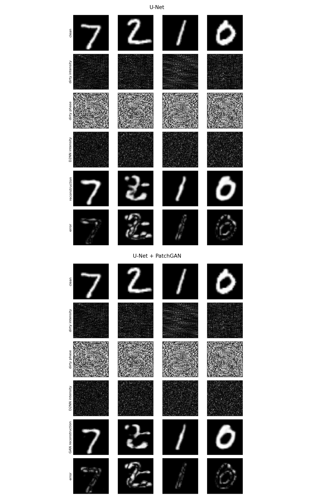

# Scattering GAN Simulation

A compact research simulation for reconstructing clean targets from
scattering-corrupted coherent intensity measurements. The project combines a
controlled optical forward model with U-Net reconstruction and optional
conditional PatchGAN refinement.

```text
MNIST target -> coherent field -> scattering-like corruption -> propagation
             -> fixed diffractive layer -> U-Net -> optional PatchGAN
```



## Scope

This repository is a simulation baseline for research development, not a
calibrated optical instrument or a generic image-to-image GAN example. It is
intended to support controlled experiments on fixed diffusers, unseen diffuser
generalization, adversarial refinement, and later diffractive front ends.

Each training run writes a schema-v1 `config.json` before training, then
records the diffuser split, optical parameters, observation normalization,
loss weights, metric aggregation protocol, package versions, and Git state in
its manifest. The flat `metrics.json` format is retained for compatibility.

## Quick Start

Python 3.12 and `uv` are required.

```bash
git clone <repository-url>
cd scattering-gan-sim
uv sync --group dev
uv run python -m check_deps
uv run pytest
```

List all experiment commands:

```bash
uv run python -m experiment --help
```

## Experiments

Inspect one coherent optical path:

```bash
uv run python -m experiment d2nn \
  --output-dir outputs/d2nn_inspection \
  --download \
  --corruption phase
```

Run a minimal U-Net smoke test:

```bash
uv run python -m experiment unet \
  --output-dir outputs/unet_small \
  --download \
  --max-train-batches 1 \
  --max-eval-batches 1
```

Run an unseen-diffuser E1 experiment:

```bash
uv run python -m experiment unet \
  --output-dir outputs/e1_unseen \
  --download \
  --train-diffuser-ids 0 1 2 3 \
  --eval-diffuser-ids 4 5 \
  --train-limit 2048 \
  --eval-limit 256
```

The manifest reports `eval_diffuser_split: "unseen"` when evaluation IDs are
disjoint from training IDs. Run a corresponding seen-diffuser experiment with
evaluation IDs drawn from the training set.

The same reconstruction-loss flags are available to `unet`, `gan`, and
`full`: `--l1-weight`, `--negative-pearson-weight`, `--ssim-weight`, and
`--fourier-weight`. Their exact values are saved in both `config.json` and the
manifest.

Assess the frozen Luo 2022 R0 profile before a full run:

```bash
uv run python -m experiment d2nn \
  --profile luo2022_r0 \
  --action assess \
  --device cpu \
  --output-dir outputs/luo2022_r0_assessment
```

Freeze `2026-07-17.2` passes the reduced training rerun and the exact
240x240 audit of all 1,999,000 unordered pairs in a 2,000-diffuser bank. The
R0 path is ready to transfer to a CUDA machine; a local GPU benchmark is not a
prerequisite. Machine-specific readiness notes and reproduction working
documents remain local and are not tracked in the public repository.

Long CUDA runs write `checkpoints/latest.pt`, one deterministic diffuser bank
per epoch, `review.json`, and `run_state.json`. On limited-memory GPUs,
`--diffuser-chunk-size` accumulates the same 80 field-pair gradients before a
single optimizer update. Resume by repeating the exact command with
`--resume`.

## Exploratory Result

The included fixed-phase-diffuser comparison uses 2,048 training samples and
256 evaluation samples. PatchGAN slightly improves L1, MSE, PSNR, and SSIM, but
reduces Pearson correlation. This is evidence that the synthetic inverse path
trains end to end; it is not evidence of validity for real scattering media or
hardware.

See [the comparison note](docs/gpu-phase-comparison.md) and the
[research roadmap](docs/research-roadmap.md) for details.

## Repository Layout

```text
experiment.py      Experiment CLI: d2nn / unet / gan / compare / full
d2nn.py            Coherent propagation, phase screens, particles, and D2NN layer
coherent_data.py   Paired clean, intensity, phase, and diffuser samples
unet.py            Reconstruction model
patchgan.py         Conditional discriminator
losses.py           Reconstruction losses
metrics.py          L1, MSE, mean per-image PSNR, SSIM, and Pearson metrics
docs/               System notes, results, and roadmap
tests/              Smoke and regression tests
```

Downloaded datasets, generated runs, and trained weights are excluded from Git.
Only lightweight result figures are kept under `docs/assets/`.

## Limitations

The present forward model omits calibrated PSFs, diffuser material parameters,
sensor noise, detector calibration, hardware alignment, fabrication constraints,
and an optical implementation of GAN inference. Treat all reported results as
controlled digital simulations.

## License

This project is released under the [BSD 3-Clause License](LICENSE).
